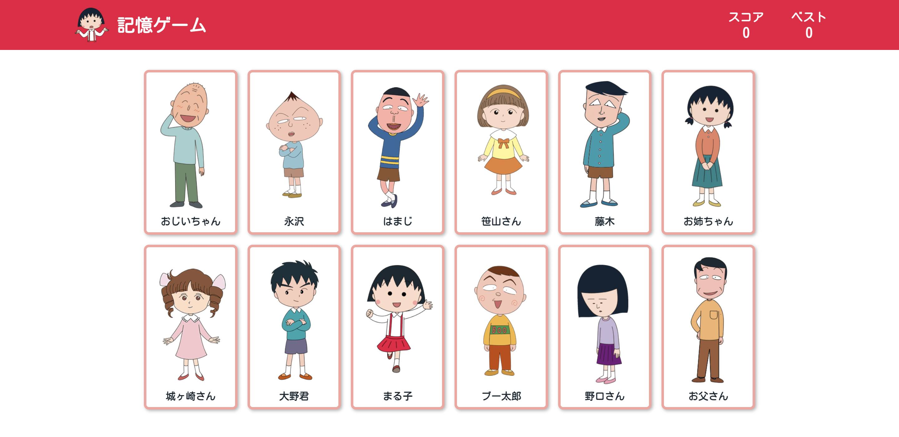

# Memory Game

Try your best not to click the same card twice in this brain training memory game.

[Live demo](https://gregolive.github.io/memory-game/) 👈

## Functionality

- On startup players are presented with a popup modal with the game instrucations and begin playing by clicking the start button
- The gameboard contains 12 cards out of a pool of 22 total cards (containg a photo and the name of a character from the show ちびまる子ちゃん)
- Players are awarded a point for every consectutive card clicked, but their score is reset if they click a card twice
- A player's best score is saved in their browser using Javascript's <code>localStorage</code>
- The app features functional components with hooks used for saving component state and perform side effects (fetching/persisting best scores and alerts)

## Reflection

Using React functional components rather than class components in this project helped me to understand why many developers have come to prefer functional components after the introduction of hooks. In my opinion, it is easier to write succient components with the use of functions and using the <code>useEffect()</code> hook is more intuitive than the various lifecycle methods from class components.

## Screenshot

